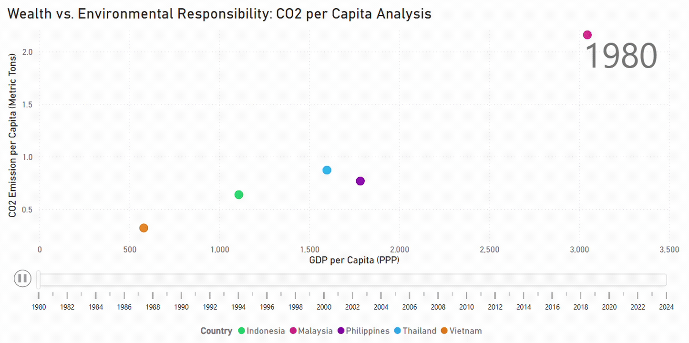
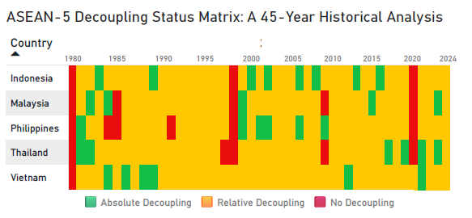
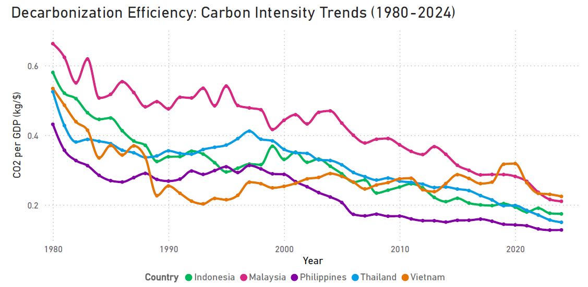
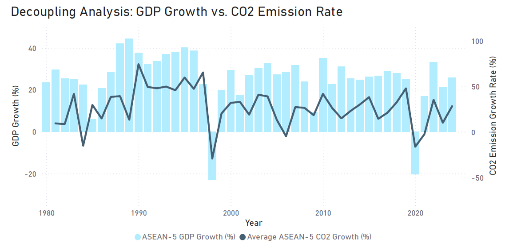
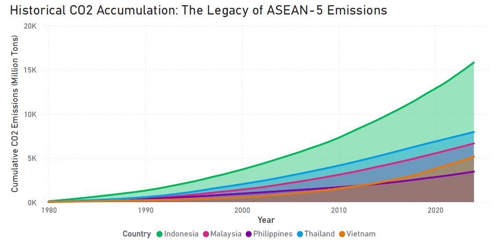
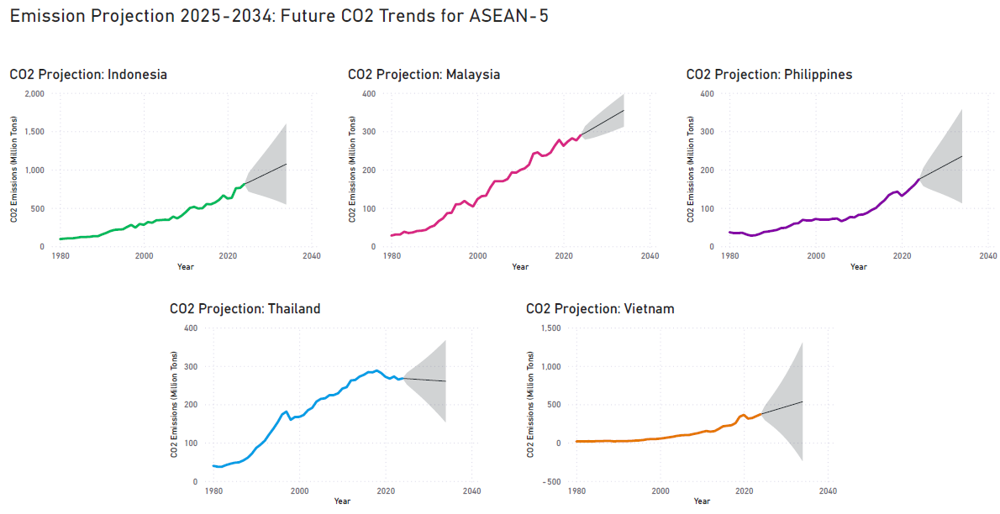

# ASEAN-5 Sustainability & Economic Decoupling Analysis (1950-2024)

***A data-driven investigation into the decoupling of GDP growth and carbon emissions across ASEAN-5 economies. Leveraging 74 years of historical data to evaluate sustainability pathways and future regional trajectories.***

---

## 1. 🚀 Project Introduction & Executive Summary
### The Sustainability Challenge

Within the context of Emerging Markets, the **ASEAN-5** (Indonesia, Malaysia, Philippines, Thailand, and Vietnam) operate at a critical intersection: **Economic Expansion vs. Environmental Integrity.** This project provides a comprehensive investigation into the historical correlation between GDP growth and carbon emissions over a 74-year period.

### Analytical Objectives
* **Decoupling Verification:** Assessing whether ASEAN-5 economies have achieved "Absolute Decoupling" (GDP growth alongside declining emissions) or remain in a state of "Relative Decoupling."
* **Data-Driven Accountability:** Utilizing long-term historical data to pinpoint economic phases with the highest and lowest carbon intensity.

### Project Deliverables
* **SQL Transformation Layer:** Systematic data cleaning and multi-source integration.
* **Power BI Interactive System:** A multi-dimensional dashboard for comparative regional analysis.
* **Economic Projections:** Predictive insights for CO<sub>2</sub> trends spanning 2025-2031.

---

## 2. 🏗️ Data Architecture & Pipeline (The SQL Power)
### Project Structure & Data Flow

To ensure a **"Single Source of Truth,"** the architecture utilizes a systematic pipeline to merge and transform disparate datasets:

* **Raw Data (Inputs):**

   * `asean_gdp_master.csv`: Historical GDP (PPP) and population data.  

   * `co2_emission_1950_2024.csv`: National CO2 emission records (Source: OWID).  

* **Transformation Layer:**

   * `transformation_logic.sql`: The "Engine" of this project. It contains the full SQL pipeline (CTE, Window Functions) for data cleaning, joining, and advanced metric engineering.  

* **Final Output:**

   * `asean_sustainability_transformed.csv`: The processed "Master Table" exported from SQL, specifically optimized and ready for Power BI dashboarding.

### Technical Implementation: The Master Join
Behind the visualizations is a robust SQL transformation layer. The following script demonstrates how disparate datasets were unified into a single analytical view:
```sql
/* 
   Advanced SQL Transformation Layer
   Target: Integration of Economic and Emission Datasets (1950-2024)
*/

CREATE VIEW v_asean_sustainability_analysis AS
WITH calculated_metrics AS (
    SELECT 
        g.*, c.co2, c.co2_per_capita,
        -- CIE: Carbon Intensity calculation
        (c.co2 / NULLIF(g.gdp_ppp_billions, 0)) AS carbon_intensity,
        -- Window Function for Year-over-Year comparison
        LAG(c.co2) OVER (PARTITION BY g.Country ORDER BY g.Year) AS prev_year_co2
    FROM asean_gdp_master g
    INNER JOIN co2_emission_1950_2024 c ON g.Year = c.year AND g.Country = c.country
)
SELECT *,
    -- Decoupling Classification Logic
    CASE 
        WHEN gdp_growth > 0 AND (co2 - prev_year_co2) < 0 THEN 'Absolute Decoupling'
        WHEN gdp_growth > 0 AND (co2 - prev_year_co2) < gdp_growth THEN 'Relative Decoupling'
        ELSE 'No Decoupling'
    END AS decoupling_status
FROM calculated_metrics;
```

### Technical Implementation:
* **Data Cleaning:** Handling of null values and type-casting to ensure computational accuracy.
* **The Master Join:** Execution of an INNER JOIN on Year and Country keys to eliminate data silos.
* **Advanced Analytics:** Deployment of SQL Window Functions to calculate **Year-over-Year (YoY) Growth** and rolling averages at the database level.

---

## 3. 📈 Advanced Metric Engineering
The analysis moves beyond raw data by engineering sophisticated sustainability metrics to evaluate economic efficiency:
* **Carbon Intensity of Economy (CIE):**

  Used as a primary indicator of energy efficiency, measuring how many tons of *CO<sub>2</sub>* are emitted for every dollar of wealth generated.

  <p align="center">
    $$CIE = \frac{Total\ CO_2\ Emissions}{GDP\ (PPP)}$$
  </p> 

* **Emission per Capita vs. Wealth:**

  By integrating population data, a correlation is established between individual environmental responsibility and rising national prosperity.

  <p align="center">
  $$CO_2\ per\ Capita = \frac{Total\ CO_2\ Emissions}{Total\ Population}$$
  </p> 

* **Inflation-Adjusted Analytics:**

  To maintain longitudinal accuracy over the 74-year period, the analysis utilizes **GDP (Purchasing Power Parity)** data. This methodology inherently adjusts for inflationary pressures and currency fluctuations, providing a consistent baseline for measuring real economic growth.

* **Decoupling Classification Logic:**

  Quantitative criteria are applied to classify nations based on their ability to suppress emission growth while maintaining economic momentum, distinguishing between **Absolute Decoupling** (GDP up, Emissions down) and **Relative Decoupling** (Emissions grow slower than GDP).

---

## 4. 📊 Comparative Regional Analysis (The "Battle" of Big 5)

### 4.1 The Dynamic Decoupling Heatmap
The core of this analysis is captured in the dynamic movement of ASEAN-5 nations. The following visualization demonstrates the transition from 1950 to 2024, correlating rising prosperity with individual environmental responsibility:

<p align="center">
  <br>
  
  <br>
  <i>Figure 1: Dynamic Scatter Chart (Wealth vs. Responsibility) showing GDP per Capita vs. CO<sub>2</sub> per Capita (1950-2024)</i>
  <br>
</p>

### 4.2 Country Deep-Dive & Performance Metrics
We focus on the structural efficiencies of the economies, specifically comparing **Thailand** and **Vietnam** as representatives of different industrial phases:

* **Decoupling Status (Figure 2):** Thailand shows signs of "Relative Decoupling" as the economy matures, while Vietnam remains in a steep upward trajectory due to rapid industrialization.
* **Carbon Intensity Trend (Figure 3):** Measuring the efficiency of wealth generation (CO<sub>2</sub> emitted per $1 GDP).
* **Economic Growth vs. Emission Rate (Figure 4):** A YoY comparison to verify if economic gains are outpacing pollution growth.

<br>

<p align="center">
  
  <br>
  <i>Figure 2: Comparative Analysis of Emission Trajectories and Decoupling Status</i>
</p>

<br>

<p align="center">
  
  <br>
  <i>Figure 3: Carbon Intensity Trend (Efficiency)</i>
</p>

<br>
    
<p align="center">
  
  <br>
  <i>Figure 4: YoY Growth Rate Comparison</i>
</p>

### 4.3 Historical Context & World Benchmarking
To provide global context, regional data is benchmarked against world averages, alongside the **Historical CO<sub>2</sub> Accumulation (Figure 5)** which highlights the total carbon debt each nation has contributed since 1950.

<p align="center">
  <br>
  
  <br>
  <i>Figure 5: Historical CO<sub>2</sub> Accumulation (The Carbon Debt) from 1950 to 2024</i>
</p>

---

## 5. 🔮 Predictive Insights & Future Projections

To support long-term sustainability planning, the dashboard incorporates a **Time-Series Forecasting model** (built-in Power BI exponential smoothing) to predict emission trends for the period 2025-2031.

<p align="center">
  <br>
  
  <br>
  <i>Figure 6: 7-Year CO<sub>2</sub> Emission Projection for ASEAN-5 nations with 95% Confidence Interval</i>
  <br>
</p>

> [!IMPORTANT]
> **Key Observation:** The projection highlights a widening gap between "Business as Usual" (BAU) trends and the targets required for Carbon Neutrality in the ASEAN region.

---

## 6. 🧠 Analytical Key Insights & Summary

Based on the 74-year historical analysis of ASEAN-5, several critical patterns emerge:

* **The Middle-Income Environmental Trap:** Data indicates that most ASEAN-5 nations experience a peak in carbon intensity during their transition from agrarian to industrial economies.

* **Decoupling Variance:** **Thailand** and **Malaysia** show the earliest signs of Relative Decoupling (where GDP grows faster than emissions), whereas **Vietnam** is currently in an Emission-Intensive Growth phase, reflecting its position as a rising global manufacturing hub.

* **Historical Responsibility vs. Future Risk:** While Indonesia has the highest historical accumulated emissions, the **2031 Forecast** warns that without significant energy transition, the regional emission curve will significantly deviate from the Net-Zero targets.

---

### 7. 🏁 Conclusion

The transition from "Growth at all costs" to "Sustainable Prosperity" is the defining challenge for the ASEAN-5 region. This analysis highlights that while economic decoupling is possible, it requires a deliberate shift in energy efficiency and policy intervention. This project serves as a data-driven framework to monitor that transition through the lens of Environmental Engineering and Data Science.
---

### 8. 📚 Data Sources & References

To ensure data integrity and transparency, this project utilizes high-fidelity datasets from the following sources:

* **International Monetary Fund (IMF):** Used for historical GDP (PPP), population metrics, and future economic growth projections for ASEAN-5 nations. [Source: IMF Data Mapper]
* **Our World in Data (OWID) via Luca Lullo (Kaggle):** The primary source for CO<sub>2</sub> emission records, provided in the `co2_emission_1950_2024.csv file`.
* **Methodology:** All data was unified via SQL in `transformation_logic.sql` and exported to `asean_sustainability_transformed.csv` for longitudinal analysis.

